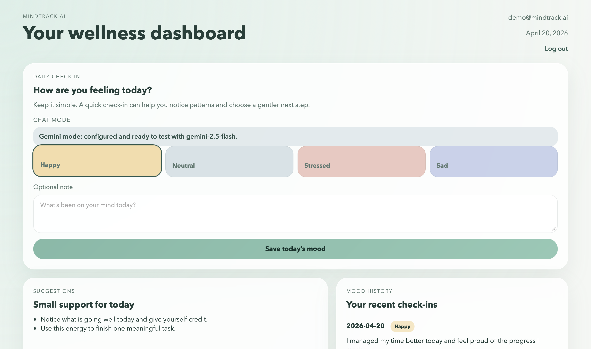
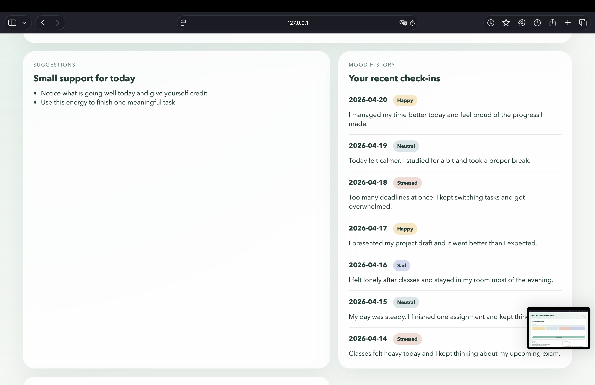
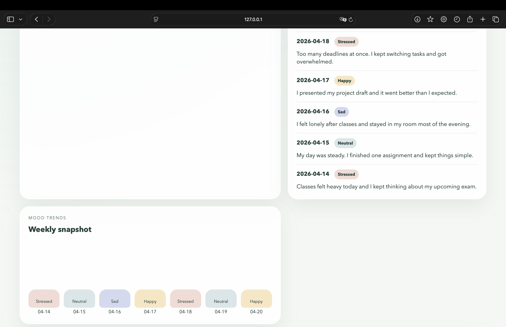
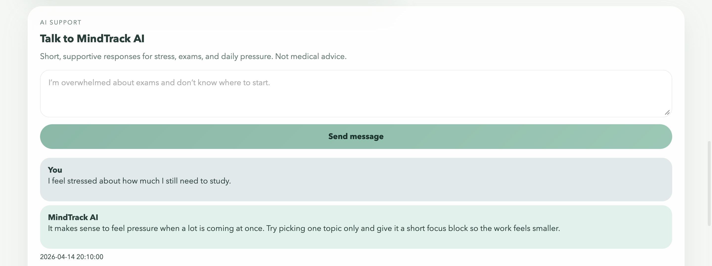
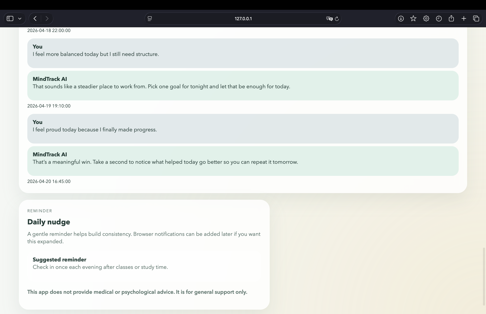

# MindTrack AI

MindTrack AI is a web application designed to support student mental wellness through mood tracking, reflection, and AI-powered conversations.

## Overview

The application helps users better understand their emotional state, track mood patterns over time, and receive simple, supportive guidance through an AI assistant. It focuses on accessibility, simplicity, and everyday usability for students dealing with stress and academic pressure.

## Features

- User authentication (email & password)
- Personal dashboard for each user
- Daily mood check-ins with optional notes
- Mood history tracking
- Simple mood-based suggestions
- AI chat assistant for emotional support
- Clear disclaimer (not medical advice)
- Responsive and calming user interface

## Tech Stack

- Python (standard library HTTP server)
- SQLite database
- HTML + CSS (custom templates)
- Gemini API (AI chat integration)
- Deployment: Render
- Version control: GitHub

## AI Integration

The AI functionality evolved through experimentation with multiple approaches, including OpenAI and local models (Ollama), before integrating the Gemini API for public deployment.

The chat system includes:
- Retry logic for failed requests
- Fallback model support  
- Handling of incomplete or cut-off responses  

Current configuration:
- Primary model: `gemini-2.5-flash`
- Fallback model: `gemini-2.5-flash-lite`

## Development Challenges

During development, several technical challenges were addressed:

- Implementing a working authentication system
- Stabilizing AI responses from external APIs
- Handling incomplete or inconsistent AI outputs
- Managing API reliability with retry and fallback logic
- Configuring deployment and environment variables on Render

## Limitations

The current version functions as a public demo.

- The app uses SQLite on free hosting (Render)
- Data persistence is not fully reliable
- Users may experience session resets or data loss after restarts or redeployments

A production-ready version would involve migrating to a more robust database such as PostgreSQL.

## Live Demo

https://mindtrack-ai-4gqv.onrender.com

## Repository

https://github.com/blindyzzz/mindtrack-ai

## Purpose

This project explores how AI can be used to build practical, user-focused tools that address real-world problems. It combines elements of software development, user experience design, and social impact.

## Disclaimer

This application does not provide medical or psychological advice. It is intended for general emotional support only.

## Screenshots

### Dashboard & Daily Check-in

Users can quickly log their daily mood and reflect with a short note, helping them build self-awareness and recognize emotional patterns over time.

### Mood Tracking & History

A structured view of past entries allows users to track their emotional trends and better understand how their feelings evolve day by day.

### Weekly Insights

Weekly insights summarize mood trends, helping users identify patterns and make more informed decisions about their habits and routines.

### AI Support Chat

An AI-powered assistant provides supportive, real-time responses to help users manage stress, reflect on their thoughts, and stay motivated.

### Smart Reminders & Disclaimer

Gentle reminders encourage consistent usage, while clear disclaimers ensure the app is positioned as supportive guidance rather than medical advice.
